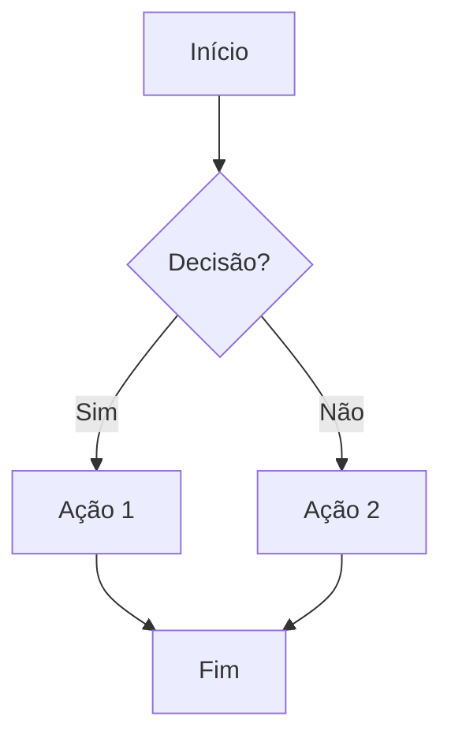
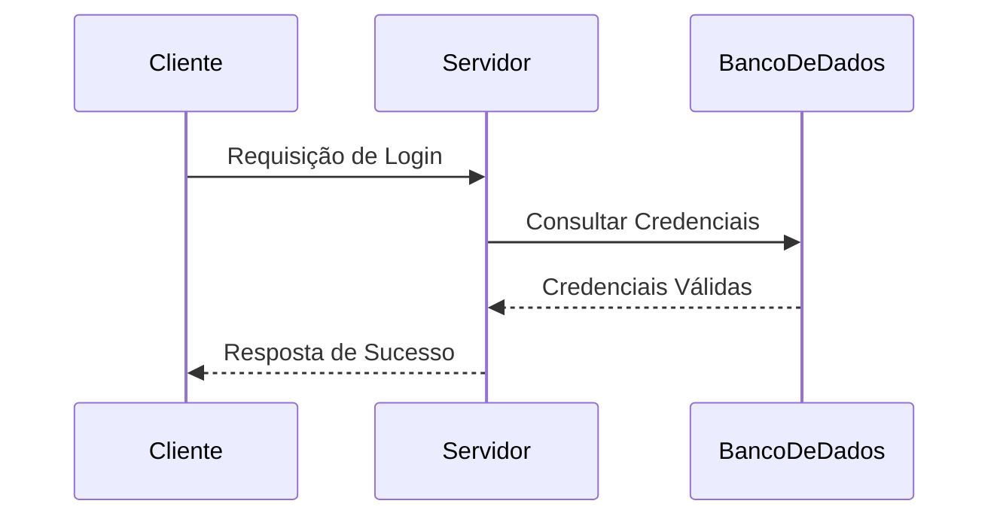

# <i class="fa-solid fa-house"></i> Início

> *Última atualização: 2025-12-14*

Este é um exemplo de arquivo formatado para ser usado com **Docsify**, demonstrando a integração de **KaTeX** (para fórmulas matemáticas), **Mermaid** (para diagramas) e blocos de **código**.

-----

### 🚀 Introdução

Este projeto utiliza o Docsify para criar uma documentação simples e dinâmica. Abaixo, você encontrará exemplos de recursos avançados suportados, como renderização de $\text{LaTeX}$ e diagramas.

### 📐 Fórmulas Matemáticas com KaTeX

O Docsify, com o plugin KaTeX, permite renderizar equações matemáticas complexas de forma elegante.

#### Equações Inline

A fórmula da relatividade de Einstein é $E = mc^2$, onde $E$ é energia, $m$ é massa e $c$ é a velocidade da luz.

#### Equações em Bloco

Para uma equação mais complexa, como a Integral de Gauss, usamos o formato de bloco:

$$
\int_{-\infty}^{\infty} e^{-x^2} dx = \sqrt{\pi}
$$

Outro exemplo é a Série de Taylor de uma função $f(x)$ em torno de um ponto $a$:

$$
f(x) = \sum_{n=0}^{\infty} \frac{f^{(n)}(a)}{n!}(x-a)^n
$$

### 📊 Diagramas com Mermaid

O plugin Mermaid permite criar diagramas e fluxogramas diretamente do texto.

#### Fluxograma Simples

Abaixo está um diagrama de fluxo simples que representa um processo de decisão:



#### Diagrama de Sequência

Este diagrama mostra a interação de três participantes:



### 💻 Blocos de Código

O Docsify suporta o destaque de sintaxe para vários idiomas.

#### Exemplo de Código JavaScript

```javascript
/**
 * Função para calcular o n-ésimo número de Fibonacci.
 * @param {number} n - O índice do número de Fibonacci (n >= 0).
 * @returns {number} O n-ésimo número de Fibonacci.
 */
function fibonacci(n) {
  if (n <= 1) {
    return n;
  }
  return fibonacci(n - 1) + fibonacci(n - 2);
}

console.log(fibonacci(10)); // Saída: 55
```

#### Exemplo de Código Python

```python
# Script Python para demonstrar uma classe simples
class Pessoa:
    def __init__(self, nome, idade):
        self.nome = nome
        self.idade = idade

    def saudacao(self):
        return f"Olá, meu nome é {self.nome} e tenho {self.idade} anos."

# Criando uma instância
pessoa1 = Pessoa("Alice", 30)
print(pessoa1.saudacao())
```
